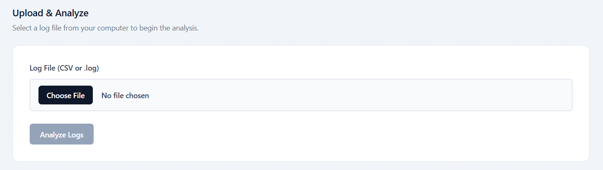
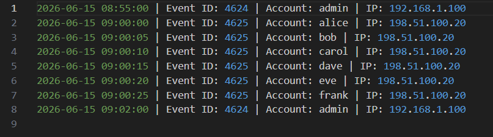
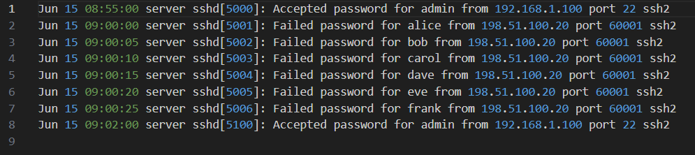
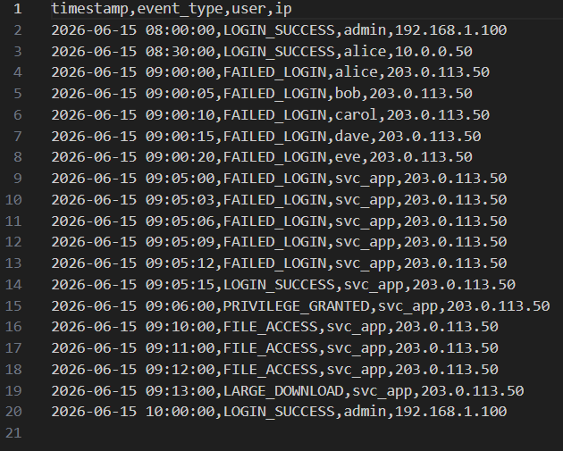
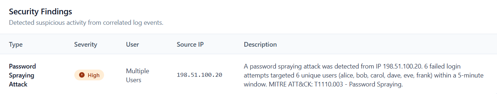
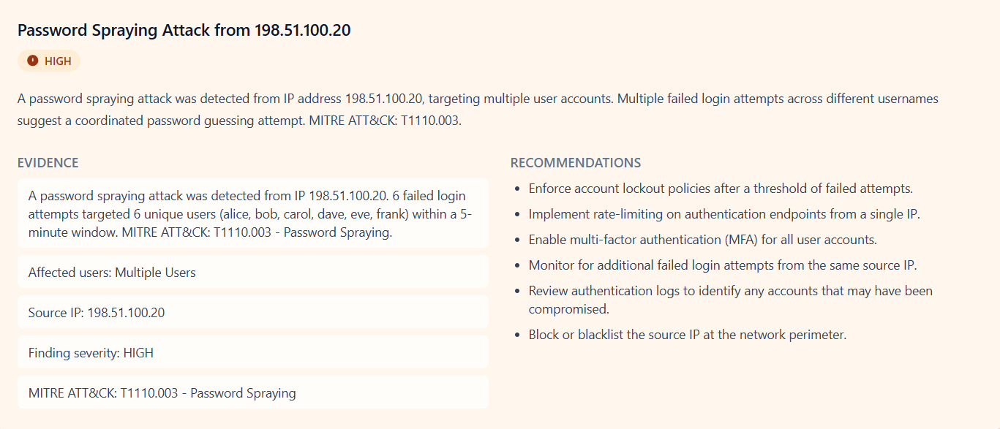

# AI SOC Analyst

AI SOC Analyst automates the early stages of security log investigation. Upload a log file, and the system parses events, correlates suspicious activity through modular detection rules, and produces structured incident investigation reports — all through a web interface.

The backend is a FastAPI application that orchestrates a [LangGraph](https://langchain-ai.github.io/langgraph/) workflow of specialized SOC agents. The frontend is a React single-page application with file upload and results visualization.

No authentication, database, or external dependencies are required to run the core analysis. Report generation defaults to deterministic templates, with an optional upgrade to Google Gemini for AI-written summaries, evidence, and recommendations.

---

## Key Features

- **Multi-format log parsing** — CSV, Linux auth.log, and Windows Security event logs
- **Parser factory with auto-detection** — the system detects the log format from file content and selects the correct parser; no manual format selection needed
- **Four detection rules** — Brute Force, Password Spraying, Privilege Escalation, and Data Exfiltration
- **Modular rule architecture** — rules are independent classes implementing a common `DetectionRule` interface, making them simple to add, remove, or parameterize
- **LangGraph workflow** — a four-stage directed graph (`parse_logs → correlate_events → investigate_findings → generate_reports`) with typed shared state
- **Template-based report generation** — every finding type has a deterministic report template with incident title, summary, evidence, and remediation recommendations
- **Optional Gemini AI reports** — when a `GEMINI_API_KEY` is configured, the investigation agent generates reports using `gemini-2.0-flash`, with automatic fallback to templates on any failure
- **Web UI** — upload page with drag-and-drop, toast notifications, severity-coded findings table, and investigation report cards
- **REST API** — `GET /health` and `POST /analyze` endpoints with multipart file upload

---

## Supported Log Formats

| Format | Event Types | Example |
|--------|-------------|---------|
| **CSV** | `FAILED_LOGIN`, `LOGIN_SUCCESS`, `PRIVILEGE_GRANTED`, `FILE_ACCESS`, `LARGE_DOWNLOAD` | Columns: `timestamp`, `event_type`, `user`, `ip` |
| **Linux auth.log** | `FAILED_LOGIN` (sshd), `LOGIN_SUCCESS` (sshd) | Syslog entries matching `Accepted/Failed password for <user> from <IP>` |
| **Windows Security Log** | `FAILED_LOGIN` (Event ID 4625), `LOGIN_SUCCESS` (4624), `PRIVILEGE_GRANTED` (4672) | Pipe-delimited compact format or multiline Event Viewer blocks |

The log parser factory samples the first lines of a file and uses content-based heuristics to detect the format before falling back to file extension.

---

## Detection Rules

| Rule | Pattern | Severity |
|------|---------|----------|
| **Brute Force Attack** | 5+ `FAILED_LOGIN` events followed by `LOGIN_SUCCESS` for the same user and IP | `HIGH` |
| **Password Spraying Attack** | 5+ unique user accounts targeted with `FAILED_LOGIN` from the same IP within 5 minutes (MITRE ATT&CK T1110.003) | `HIGH` |
| **Privilege Escalation** | `LOGIN_SUCCESS` immediately followed by `PRIVILEGE_GRANTED` for the same user | `CRITICAL` |
| **Data Exfiltration** | `LOGIN_SUCCESS` → 2+ `FILE_ACCESS` events → `LARGE_DOWNLOAD` for the same user | `HIGH` |

All rules live in `backend/agents/rules/` and extend the abstract `DetectionRule` class. The `CorrelationAgent` runs every registered rule against the sorted event stream and collects matching findings.

---

## Architecture Overview

```
┌─────────────────┐     POST /analyze      ┌──────────────────────────────────────┐
│  React Frontend │ ──────────────────────► │           FastAPI Backend           │
│  (Vite + TS)    │ ◄────────────────────── │                                      │
└─────────────────┘   findings + reports   │  AnalysisService → SOCWorkflowRunner │
                                            └──────────────────┬───────────────────┘
                                                               │
                               ┌───────────────────────────────▼───────────────────────────────┐
                               │                    LangGraph Workflow                        │
                               │                                                               │
                               │  parse_logs → correlate_events → investigate → gen_reports   │
                               └───────────────────────┬───────────────────────────────────────┘
                                                       │
                     ┌─────────────────────────────────┼─────────────────────────────────┐
                     ▼                                 ▼                                 ▼
             LogParserAgent                    CorrelationAgent                  InvestigationAgent
         (factory → parser instance)        (modular DetectionRules)       (TemplateReportGenerator
                                                                             or GeminiReportGenerator)
```

### LangGraph Workflow

The workflow is a [`StateGraph`](https://langchain-ai.github.io/langgraph/concepts/high_level/) with four sequential nodes:

1. **parse_logs** — The `LogParserAgent` delegates to the parser factory, which auto-detects the format and returns typed `SecurityEvent` objects.
2. **correlate_events** — The `CorrelationAgent` runs the event stream through every registered `DetectionRule` and collects `SecurityFinding` objects.
3. **investigate_findings** — The `InvestigationAgent` converts each finding into an `InvestigationReport` using the configured report generator.
4. **generate_reports** — A validation node that checks report count against finding count and verifies required fields before passing results to the API.

Shared state is typed as `SOCWorkflowState` (a `TypedDict` with `log_file_path`, `security_events`, `security_findings`, and `investigation_reports`).

### Dependency Injection

All agents accept optional constructor arguments, making them easy to swap for testing:

```python
# Default (template reports)
runner = SOCWorkflowRunner()

# With Gemini AI
from agents.investigation_agent import InvestigationAgent
from agents.report_generators import GeminiReportGenerator
runner = SOCWorkflowRunner(
    investigation_agent=InvestigationAgent(
        report_generator=GeminiReportGenerator()
    )
)
```

---

## Tech Stack

### Backend

| Technology | Purpose |
|------------|---------|
| Python 3.13 | Runtime |
| FastAPI | REST API framework |
| Pydantic v2 | Data validation and schemas |
| LangGraph | Agent workflow orchestration |
| Google Generative AI | Optional Gemini report generation |
| pytest | Unit and integration testing |

### Frontend

| Technology | Purpose |
|------------|---------|
| React 18 | UI framework |
| TypeScript | Type-safe JavaScript |
| Vite | Build tool and dev server |
| Tailwind CSS | Utility-first styling |
| React Router v6 | Client-side routing |

---

## Project Structure

```
ai-soc-analyst/
├── backend/
│   ├── app/                          # FastAPI application
│   │   ├── main.py                   # App factory, CORS, router registration
│   │   ├── api/
│   │   │   ├── deps.py               # Dependency injection (workflow runner, service)
│   │   │   └── v1/router.py          # GET /health, POST /analyze
│   │   ├── schemas/                  # Pydantic models
│   │   │   ├── analyze.py            # AnalyzeResponse, HealthResponse
│   │   │   ├── security_event.py     # SecurityEvent
│   │   │   ├── security_finding.py   # SecurityFinding
│   │   │   └── investigation_report.py
│   │   └── services/
│   │       └── analysis_service.py   # Validation, temp file, workflow invocation
│   ├── agents/
│   │   ├── graphs/                   # LangGraph workflow
│   │   │   ├── state.py              # SOCWorkflowState TypedDict
│   │   │   ├── nodes.py              # Node functions
│   │   │   ├── workflow.py           # StateGraph builder
│   │   │   └── runner.py             # SOCWorkflowRunner
│   │   ├── log_parsers/              # Parser interfaces and implementations
│   │   │   ├── base.py               # LogParser ABC
│   │   │   ├── factory.py            # Auto-detect + get_log_parser()
│   │   │   ├── csv_log_parser.py
│   │   │   ├── linux_auth_log_parser.py
│   │   │   └── windows_security_log_parser.py
│   │   ├── rules/                    # Detection rules (pluggable)
│   │   │   ├── base.py               # DetectionRule ABC
│   │   │   ├── brute_force.py
│   │   │   ├── password_spraying.py  # Configurable threshold + time window
│   │   │   ├── privilege_escalation.py
│   │   │   └── data_exfiltration.py
│   │   ├── report_generators/        # Report generation
│   │   │   ├── base.py               # ReportGenerator ABC
│   │   │   ├── template_report_generator.py
│   │   │   ├── templates.py          # Report content builders
│   │   │   ├── gemini_report_generator.py  # Optional Gemini with template fallback
│   │   │   └── gemini_client.py      # API client, prompt builder, Pydantic response
│   │   ├── log_parser_agent.py
│   │   ├── correlation_agent.py
│   │   └── investigation_agent.py
│   └── tests/
│       ├── api/
│       │   ├── conftest.py
│       │   ├── test_health.py
│       │   ├── test_analyze.py
│       │   ├── test_analyze_auth_log.py
│       │   └── test_analyze_windows_log.py
│       └── agents/
│           └── test_soc_workflow.py
├── frontend/
│   ├── src/
│   │   ├── pages/                    # UploadLogsPage, AnalysisResultsPage
│   │   ├── components/               # Layout, FindingsTable, ReportCard, ToastContainer
│   │   ├── context/                  # AnalysisContext, ToastContext
│   │   ├── services/api.ts           # API client (analyzeLogFile)
│   │   └── types/api.ts              # TypeScript interfaces
│   ├── App.tsx                       # Root component with routing + providers
│   ├── main.tsx                      # Entry point
│   └── index.css                     # Tailwind directives
├── data/
│   └── samples/                      # Attack datasets across all formats
│       ├── csv/
│       ├── linux/
│       └── windows/
└── screenshots/
```

---

## Installation and Local Setup

### Prerequisites

- Python 3.11+
- Node.js 18+
- (Optional) Google Gemini API key for AI-generated reports

### 1. Clone

```bash
git clone <repository-url>
cd ai-soc-analyst
```

### 2. Backend

```bash
cd backend
python -m venv .venv

# Windows
.venv\Scripts\activate

# macOS / Linux
source .venv/bin/activate

pip install -r requirements.txt
```

Create a `.env` file in the project root (optional, for Gemini):

```bash
cp .env.example .env
# Edit .env and set GEMINI_API_KEY if using Gemini reports
```

Start the API server:

```bash
uvicorn app.main:app --reload
```

The API is available at `http://127.0.0.1:8000`. Interactive API docs at `http://127.0.0.1:8000/docs`.

### 3. Frontend

In a separate terminal:

```bash
cd frontend
npm install
npm run dev
```

Open `http://localhost:5173` in your browser. The Vite dev server proxies `/analyze` and `/health` to the backend automatically.

For production builds, set the API URL in `frontend/.env`:

```
VITE_API_BASE_URL=http://127.0.0.1:8000
```

Then build and preview:

```bash
npm run build
npm run preview
```

---

## Screenshots

### Upload Logs



### Windows Logs



### Linux Logs



### CSV Logs



### Analysis Results — Findings


### Analysis Results — Investigation Reports


---

## Sample Datasets

The `data/samples/` directory contains labeled attack scenarios across all three supported formats. Each file documents its attack type, timeline, expected findings, and which detection rules should trigger.

| File | Format | Attack | Rules Triggered |
|------|--------|--------|-----------------|
| `csv/brute_force.csv` | CSV | Brute Force | BruteForceRule |
| `csv/password_spraying.csv` | CSV | Password Spraying | PasswordSprayingRule |
| `csv/privilege_escalation.csv` | CSV | Privilege Escalation | PrivilegeEscalationRule |
| `csv/data_exfiltration.csv` | CSV | Data Exfiltration | DataExfiltrationRule |
| `csv/mixed_attack.csv` | CSV | Multi-stage (all 4 attacks) | All four rules |
| `linux/brute_force.log` | Linux auth.log | Brute Force via SSH | BruteForceRule |
| `linux/password_spraying.log` | Linux auth.log | Password Spraying via SSH | PasswordSprayingRule |
| `windows/brute_force.log` | Windows Security | Brute Force via RDP | BruteForceRule |
| `windows/password_spraying.log` | Windows Security | Password Spraying | PasswordSprayingRule |
| `windows/privilege_escalation.log` | Windows Security | Privilege Escalation | PrivilegeEscalationRule |
| `windows/post_bruteforce_escalation.log` | Windows Security | Brute Force → Escalation chain | BruteForceRule + PrivilegeEscalationRule |

See `data/samples/README.md` for detailed timelines and expected output.

### Quick test with curl

```bash
curl -X POST http://127.0.0.1:8000/analyze \
  -F "file=@data/samples/csv/brute_force.csv"
```

---

## API Reference

### `GET /health`

Returns service status.

**Response `200 OK`**
```json
{
  "status": "ok"
}
```

### `POST /analyze`

Analyze an uploaded log file.

**Request**
- Content-Type: `multipart/form-data`
- Body: `file` — a CSV, Linux auth.log, or Windows Security log file

**Response `200 OK`**
```json
{
  "findings": [
    {
      "finding_type": "Brute Force Attack",
      "severity": "HIGH",
      "description": "5 failed login attempts followed by a successful login for user 'svc_app' from IP 203.0.113.50.",
      "affected_user": "svc_app",
      "source_ip": "203.0.113.50"
    }
  ],
  "investigation_reports": [
    {
      "incident_title": "Brute Force Attack Targeting svc_app",
      "severity": "HIGH",
      "summary": "A brute force attack was detected against user 'svc_app'...",
      "evidence": [
        "5 failed login attempts followed by a successful login",
        "Affected user: svc_app",
        "Source IP: 203.0.113.50"
      ],
      "recommendations": [
        "Reset the affected user's password immediately.",
        "Force logout of all active sessions for the account.",
        "Block or rate-limit the source IP at the firewall or WAF."
      ]
    }
  ]
}
```

**Error responses**

| Status | Cause |
|--------|-------|
| `400` | Invalid file type, empty file, or unsupported content type |
| `422` | Invalid CSV structure or missing required columns |
| `500` | Unexpected server error |

---

## Testing

### Backend

```bash
cd backend
python -m pytest -v
```

The test suite covers:
- API endpoint behavior (health, analysis, validation, error handling)
- All four detection rules with controlled event sequences
- Log parser edge cases (empty files, missing columns, unsupported formats)
- LangGraph node functions in isolation
- Full workflow integration (end-to-end graph invocation)
- Agent dependency injection
- Optional Gemini report generator with mock client

### Frontend

```bash
cd frontend
npm run build          # TypeScript type check + production build
```

---

## Future Roadmap

- **Threat intelligence enrichment** — IP reputation lookups and IOC matching
- **Additional detection rules** — lateral movement, impossible travel, anomalous file access, ransomware patterns
- **Report export** — PDF/JSON export of findings and investigation reports
- **Analysis history** — store past results for review and comparison
- **Analyst feedback loop** — mark findings as true/false positive to tune detections
- **Authentication and RBAC** — multi-user access with role-based permissions
- **Dashboard and metrics** — trend charts, alert volume, and mean-time-to-detect tracking
- **Log streaming** — syslog and webhook ingestion for near-real-time analysis

---

## License

This project is provided for educational and demonstration purposes.

## 🌐 Live Demo

[Demo link](https://ai-soc-analyst-9dgzmoteu-maburans-projects.vercel.app/)
