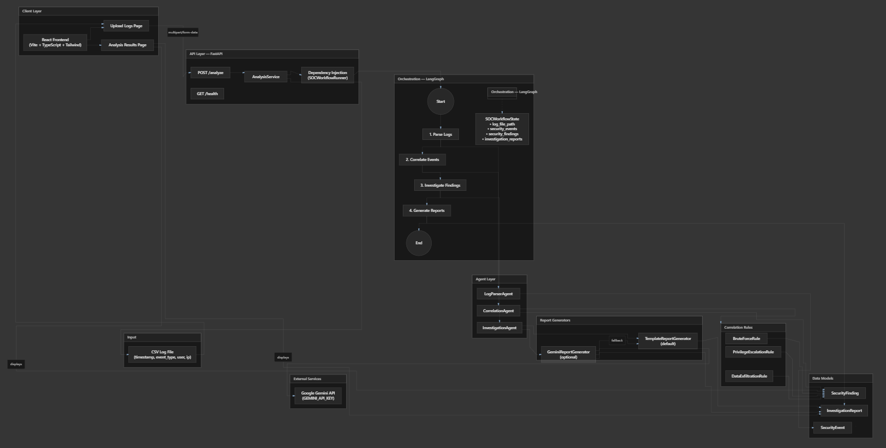

# AI SOC Analyst

An AI-assisted Security Operations Center (SOC) analyst that ingests CSV security logs, detects suspicious activity through rule-based correlation, and produces structured incident investigation reports.

Upload a log file, run analysis, and review findings and reports through a simple web interface — no authentication or account management required.

---

## Overview

AI SOC Analyst automates the early stages of security log investigation. It parses authentication and access events, correlates patterns such as brute force attacks and privilege escalation, and generates analyst-ready investigation reports.

The system is built as a modular pipeline of specialized agents orchestrated by a LangGraph workflow, exposed through a FastAPI backend and a React frontend.

**Core workflow:** Upload CSV logs → Parse events → Correlate findings → Investigate → Generate reports

---

## Features

### Log ingestion and parsing
- Upload CSV security logs via web UI or REST API
- Validates log format (`timestamp`, `event_type`, `user`, `ip`)
- Converts raw rows into typed `SecurityEvent` objects

### Threat correlation (rule-based)
Detects suspicious activity patterns including:

| Detection | Rule |
|-----------|------|
| **Brute Force Attack** | 5+ `FAILED_LOGIN` events followed by `LOGIN_SUCCESS` (same user and IP) |
| **Privilege Escalation** | `LOGIN_SUCCESS` followed by `PRIVILEGE_GRANTED` (same user) |
| **Data Exfiltration** | `LOGIN_SUCCESS` → multiple `FILE_ACCESS` → `LARGE_DOWNLOAD` |

### Investigation reports
- Template-based report generation by default
- Optional Gemini-powered summaries, evidence, and recommendations
- Automatic fallback to templates if the Gemini API is unavailable

### LangGraph orchestration
- End-to-end workflow with four pipeline stages
- Shared state passed between nodes
- Injectable agents for testing and extension

### Web interface
- Upload page with loading states and error handling
- Results page with findings table and investigation report cards
- Severity color coding for quick triage

---

## Architecture

```
┌─────────────────┐     POST /analyze      ┌──────────────────────────────────────┐
│  React Frontend │ ─────────────────────► │           FastAPI Backend           │
│  (Vite + TS)    │ ◄───────────────────── │                                      │
└─────────────────┘   findings + reports   │  AnalysisService → SOCWorkflowRunner │
                                           └──────────────────┬───────────────────┘
                                                              │
                              ┌───────────────────────────────▼───────────────────────────────┐
                              │                    LangGraph Workflow                        │
                              │                                                               │
                              │  Parse Logs → Correlate Events → Investigate → Gen Reports   │
                              └───────────────────────────────┬───────────────────────────────┘
                                                              │
                    ┌─────────────────┬───────────────────────┼───────────────────────┐
                    ▼                 ▼                       ▼                       ▼
            LogParserAgent    CorrelationAgent        InvestigationAgent      Report validation
            (CSV → events)    (events → findings)     (findings → reports)    (completeness check)
```


### Agent responsibilities

| Agent | Input | Output |
|-------|-------|--------|
| `LogParserAgent` | CSV file path | `list[SecurityEvent]` |
| `CorrelationAgent` | `list[SecurityEvent]` | `list[SecurityFinding]` |
| `InvestigationAgent` | `list[SecurityFinding]` | `list[InvestigationReport]` |

### Report generators

`InvestigationAgent` accepts any `ReportGenerator` implementation:

- **`TemplateReportGenerator`** — deterministic, rule-based reports (default)
- **`GeminiReportGenerator`** — AI-generated summaries with template fallback

### Project structure

```
ai-soc-analyst/
├── backend/
│   ├── app/                    # FastAPI application
│   │   ├── api/                # Routes and dependency injection
│   │   ├── schemas/            # Pydantic models
│   │   └── services/           # Business logic
│   ├── agents/
│   │   ├── graphs/             # LangGraph workflow
│   │   ├── rules/              # Correlation detection rules
│   │   └── report_generators/  # Template and Gemini report generators
│   └── tests/
├── frontend/
│   └── src/
│       ├── pages/              # Upload Logs, Analysis Results
│       ├── components/         # FindingsTable, ReportCard, etc.
│       └── services/           # API client
└── data/
    └── sample_security_logs.csv
```

---

## Screenshots

> Add screenshots to a `docs/screenshots/` folder and update the paths below.

### Upload Logs
<!--  -->
*Upload page — select a CSV file and run SOC analysis.*

### Analysis Results — Findings
<!--  -->
*Findings table showing detected threats with severity, user, and source IP.*

### Analysis Results — Investigation Reports
<!--  -->
*Investigation report cards with summary, evidence, and recommendations.*

---

## Setup

### Prerequisites

- Python 3.11+
- Node.js 18+
- (Optional) Google Gemini API key for AI-generated reports

### 1. Clone the repository

```bash
git clone <repository-url>
cd ai-soc-analyst
```

### 2. Backend setup

```bash
cd backend
python -m venv .venv

# Windows
.venv\Scripts\activate

# macOS / Linux
source .venv/bin/activate

pip install -r requirements.txt
```

Create a `.env` file in the project root (optional, for Gemini):

```bash
cp .env.example .env
# Edit .env and set GEMINI_API_KEY if using Gemini reports
```

Start the API server:

```bash
uvicorn app.main:app --reload
```

The API will be available at `http://127.0.0.1:8000`.

Interactive API docs: `http://127.0.0.1:8000/docs`

### 3. Frontend setup

In a separate terminal:

```bash
cd frontend
npm install
npm run dev
```

Open `http://localhost:5173` in your browser.

The Vite dev server proxies `/analyze` and `/health` to the backend automatically.

For production builds, set the API URL in `frontend/.env`:

```
VITE_API_BASE_URL=http://127.0.0.1:8000
```

Then build and preview:

```bash
npm run build
npm run preview
```

### 4. Sample log file

A sample CSV is included at `data/sample_security_logs.csv`:

```csv
timestamp,event_type,user,ip
2026-06-01 10:01:00,FAILED_LOGIN,admin,1.2.3.4
2026-06-01 10:02:00,FAILED_LOGIN,admin,1.2.3.4
2026-06-01 10:03:00,LOGIN_SUCCESS,admin,1.2.3.4
```

---

## API documentation

### `GET /health`

Check service status.

**Response `200 OK`**

```json
{
  "status": "ok"
}
```

---

### `POST /analyze`

Analyze an uploaded CSV security log file.

**Request**

- Content-Type: `multipart/form-data`
- Body: `file` — CSV file with columns `timestamp`, `event_type`, `user`, `ip`

**Example (curl)**

```bash
curl -X POST http://127.0.0.1:8000/analyze \
  -F "file=@data/sample_security_logs.csv"
```

**Response `200 OK`**

```json
{
  "findings": [
    {
      "finding_type": "Brute Force Attack",
      "severity": "HIGH",
      "description": "5 failed login attempts followed by a successful login for user 'admin' from IP 1.2.3.4.",
      "affected_user": "admin",
      "source_ip": "1.2.3.4"
    }
  ],
  "investigation_reports": [
    {
      "incident_title": "Brute Force Attack Targeting admin",
      "severity": "HIGH",
      "summary": "A brute force attack was detected against user 'admin'...",
      "evidence": [
        "5 failed login attempts followed by a successful login...",
        "Affected user: admin",
        "Source IP: 1.2.3.4",
        "Finding severity: HIGH"
      ],
      "recommendations": [
        "Reset the affected user's password immediately.",
        "Force logout of all active sessions for the account.",
        "Block or rate-limit the source IP at the firewall or WAF."
      ]
    }
  ]
}
```

**Error responses**

| Status | Cause |
|--------|-------|
| `400` | Invalid file type, empty file, or bad content type |
| `422` | Invalid CSV structure or missing required columns |
| `500` | Unexpected server error |

---

## Tech stack

### Backend
| Technology | Purpose |
|------------|---------|
| Python 3.13 | Runtime |
| FastAPI | REST API framework |
| Pydantic | Data validation and schemas |
| LangGraph | Agent workflow orchestration |
| Google Generative AI | Optional Gemini report generation |
| pytest | Unit and integration testing |

### Frontend
| Technology | Purpose |
|------------|---------|
| React 18 | UI framework |
| TypeScript | Type-safe JavaScript |
| Vite | Build tool and dev server |
| Tailwind CSS | Utility-first styling |
| React Router | Client-side routing |

---

## Running tests

### Backend

```bash
cd backend
python -m pytest -v
```

Run specific test suites:

```bash
python -m pytest tests/agents/ -v      # Agent and workflow tests
python -m pytest tests/api/ -v        # API endpoint tests
```

### Frontend

```bash
cd frontend
npm run build    # TypeScript check + production build
```

---

## Future enhancements

- **Threat intelligence integration** — enrich findings with IP reputation and IOC lookups
- **SQLite persistence** — store events, findings, and reports for historical analysis
- **Real-time log streaming** — ingest logs via syslog or webhook instead of file upload only
- **Additional correlation rules** — lateral movement, impossible travel, anomalous file access
- **Analyst feedback loop** — mark findings as true/false positive to improve detection
- **Export and ticketing** — PDF report export and integration with Jira or ServiceNow
- **Authentication and RBAC** — multi-user access with role-based permissions
- **Dashboard and metrics** — trend charts, MTTR tracking, and alert volume over time
- **Hybrid AI pipeline** — combine Gemini summaries with structured template fields per finding type

---

## License

This project is provided for educational and demonstration purposes.
